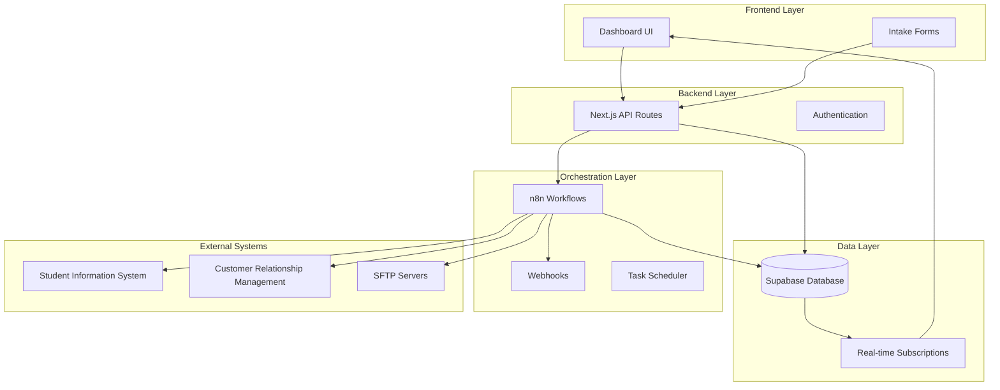

# Design Document: Autonomous Onboarding Orchestrator

## Overview

The Airr 3.0 Autonomous Onboarding Orchestrator is a production-ready Next.js application that provides a self-driving customer onboarding system. The system orchestrates the entire customer journey from contract signing to full activation through automated task management, real-time progress tracking, and intelligent escalation handling.

**Core Design Principle**: The onboarding workflow is implemented as a **first-class part of the product**, not externalized to automation tools. This ensures deterministic, auditable, and evolvable business logic that remains transparent and debuggable.

The architecture follows a three-tier approach with clear separation of concerns:
- **Frontend**: Next.js React application with real-time dashboard
- **Backend**: Next.js API routes with Supabase integration  
- **Orchestration**: n8n workflows for autonomous task management (execution layer only)

### Architecture Philosophy

**Workflow Ownership**: The application owns all business logic and state transitions. Each customer progresses through explicit stages (Intake → Integrations Pending → Blocked → Ready for Go-Live → Completed) with all transitions persisted in Supabase and reflected immediately in the UI.

**n8n Role**: Used intentionally as an execution and automation layer for asynchronous operations (delays, retries, notifications) rather than as the owner of workflow logic. This prevents hidden state and maintains system transparency.

**State-Driven Design**: All onboarding state is queryable, debuggable, and replayable. The UI always reflects the true operational state, and business rules are versionable alongside application code.

## Architecture



## Components and Interfaces

### Frontend Components

**Dashboard Component**
- Real-time onboarding progress visualization
- Task status tracking with owner assignments
- Blocker highlighting and escalation management
- Time-to-value metrics display
- Uses Supabase real-time subscriptions for live updates

**Customer Intake Component**
- Multi-step form for customer details capture
- Integration requirements specification
- Stakeholder role assignment
- Go-live date scheduling
- Form validation and error handling

### Backend API Routes

**Onboarding API (`/api/onboarding`)**
- POST: Create new customer onboarding
- GET: Retrieve onboarding status and details
- PUT: Update onboarding progress and status
- Integrates with n8n webhook triggers

**Tasks API (`/api/tasks`)**
- GET: Retrieve tasks for specific onboarding
- PUT: Update task status and completion
- POST: Create manual tasks or blockers
- Handles task assignment and owner notifications

**Dashboard API (`/api/dashboard`)**
- GET: Aggregate dashboard data
- Real-time metrics calculation
- Progress tracking and analytics
- Blocker summary and escalation status

### Database Schema

The system uses the existing Supabase schema with the following core tables:

**customers**
- Stores customer information and contract details
- Links to onboarding records

**onboardings** 
- Tracks overall onboarding progress and status
- Calculates time-to-value metrics
- Links customers to their onboarding tasks

**onboarding_tasks**
- Individual task management with ownership
- Status tracking and completion timestamps
- Blocker identification and escalation flags

**events_audit**
- Comprehensive audit trail for all system events
- Supports debugging and compliance requirements

### n8n Orchestration Workflows

**Task Generation Workflow**
- Triggered by new onboarding creation
- Generates standard task templates based on customer requirements
- Assigns tasks to appropriate stakeholders
- Sets due dates based on go-live timeline

**Reminder and Escalation Workflow**
- Monitors task due dates and sends automated reminders
- Escalates overdue tasks to management
- Creates blocker records for failed tasks
- Integrates with external notification systems

**Integration Monitoring Workflow**
- Tests connectivity to required external systems
- Validates data synchronization
- Reports integration status and failures
- Triggers remediation workflows for issues

## Data Models

### Customer Model
```typescript
interface Customer {
  id: string;
  name: string;
  contract_start_date: Date;
  contact_email?: string;
  industry?: string;
  size?: 'small' | 'medium' | 'large' | 'enterprise';
  created_at: Date;
}
```

### Onboarding Model
```typescript
interface Onboarding {
  id: string;
  customer_id: string;
  status: 'not_started' | 'in_progress' | 'blocked' | 'completed';
  current_stage: string;
  go_live_date?: Date;
  time_to_value_days?: number;
  created_at: Date;
  completed_at?: Date;
}
```

### Task Model
```typescript
interface OnboardingTask {
  id: string;
  onboarding_id: string;
  task_type: string;
  title: string;
  description?: string;
  owner_role: string;
  assigned_to?: string;
  status: 'pending' | 'in_progress' | 'completed' | 'blocked';
  priority: 'low' | 'medium' | 'high' | 'critical';
  due_date?: Date;
  completed_at?: Date;
  is_blocker: boolean;
  blocker_reason?: string;
  created_at: Date;
}
```

### Integration Model
```typescript
interface Integration {
  id: string;
  onboarding_id: string;
  type: 'SIS' | 'CRM' | 'SFTP' | 'API' | 'other';
  name: string;
  configuration: Record<string, any>;
  status: 'not_configured' | 'configured' | 'testing' | 'active' | 'failed';
  test_results?: Record<string, any>;
  created_at: Date;
}
```

### Stakeholder Model
```typescript
interface Stakeholder {
  id: string;
  onboarding_id: string;
  role: 'owner' | 'it_contact' | 'project_manager' | 'technical_lead';
  name: string;
  email: string;
  phone?: string;
  responsibilities: string[];
  created_at: Date;
}
```

## Correctness Properties

*A property is a characteristic or behavior that should hold true across all valid executions of a system—essentially, a formal statement about what the system should do. Properties serve as the bridge between human-readable specifications and machine-verifiable correctness guarantees.*

### Property Reflection

After analyzing all acceptance criteria, several properties can be consolidated to eliminate redundancy:
- Data persistence properties (1.1, 1.2, 1.3, 1.5, 4.1) can be combined into comprehensive persistence validation
- Task management properties (2.1, 2.2) can be unified into task generation and assignment
- Dashboard display properties (3.1, 3.2) can be combined into comprehensive dashboard data validation
- Integration properties (5.1, 5.3, 5.5) can be consolidated into integration lifecycle management

### Core Properties

**Property 1: Customer Data Persistence**
*For any* valid customer intake data (name, contact info, contract details, integrations, stakeholders, go-live date), when submitted to the system, all data should be immediately persisted to Supabase with correct field mappings and referential integrity maintained.
**Validates: Requirements 1.1, 1.2, 1.3, 1.5, 4.1, 4.4**

**Property 2: Future Date Validation**
*For any* date input for go-live date, the system should accept and store only dates that are in the future, rejecting past dates with appropriate error messages.
**Validates: Requirements 1.4**

**Property 3: Automated Task Generation and Assignment**
*For any* completed customer intake, the orchestrator should automatically generate appropriate onboarding tasks based on customer requirements and assign them to correct owners based on stakeholder roles and task types.
**Validates: Requirements 2.1, 2.2**

**Property 4: Task Status Updates from External Events**
*For any* external integration event, the system should automatically update corresponding task statuses based on the event type and maintain consistency between external state and internal task tracking.
**Validates: Requirements 2.4**

**Property 5: Blocker Escalation**
*For any* task that becomes blocked, the orchestrator should create escalation records with blocker details and notify appropriate stakeholders based on their roles and responsibilities.
**Validates: Requirements 2.5, 5.4**

**Property 6: n8n Workflow Integration**
*For any* automated task operation (creation, reminder, escalation), the system should properly trigger corresponding n8n workflows with correct payload data and handle workflow responses appropriately.
**Validates: Requirements 2.6**

**Property 7: Dashboard Data Accuracy**
*For any* onboarding record, the dashboard should display accurate current stage, complete task lists with owners and statuses, highlighted blockers, and correct time-to-value calculations.
**Validates: Requirements 3.1, 3.2, 3.3, 3.4**

**Property 8: Real-time Dashboard Updates**
*For any* change in task status or onboarding progress, the dashboard should reflect these changes immediately through real-time subscriptions without requiring page refresh.
**Validates: Requirements 3.5**

**Property 9: System State Recovery**
*For any* system restart, all current onboarding state should be successfully loaded from Supabase, maintaining data consistency and allowing operations to continue seamlessly.
**Validates: Requirements 4.2**

**Property 10: Error Handling and Data Consistency**
*For any* database operation failure, the system should handle errors gracefully, maintain data consistency, and provide meaningful error messages without corrupting existing data.
**Validates: Requirements 4.3**

**Property 11: Audit Trail Completeness**
*For any* significant onboarding event (creation, task updates, status changes, completions), the system should create corresponding audit records with complete metadata for traceability.
**Validates: Requirements 4.5**

**Property 12: Integration Lifecycle Management**
*For any* integration configuration, the system should store complete configuration details, validate connectivity when tested, track completion status, and update overall onboarding progress accordingly.
**Validates: Requirements 5.1, 5.3, 5.5**

**Property 13: Integration Instructions Generation**
*For any* integration setup initiation, the system should provide clear, complete instructions and requirements to the appropriate stakeholders based on integration type and stakeholder roles.
**Validates: Requirements 5.2**

**Property 14: Environment Configuration Adaptability**
*For any* environment variable change, the system should adapt its configuration accordingly without requiring code changes, supporting different deployment environments.
**Validates: Requirements 6.4**

**Property 15: Health Check Accuracy**
*For any* health check request, the system should return accurate status information about database connectivity, n8n integration, and overall system health.
**Validates: Requirements 6.5**

## Error Handling

### Database Error Handling
- Connection failures: Implement retry logic with exponential backoff
- Transaction failures: Rollback incomplete operations and maintain consistency
- Constraint violations: Provide clear error messages and prevent data corruption
- Timeout handling: Graceful degradation with user feedback

### n8n Integration Error Handling
- Webhook failures: Queue operations for retry with dead letter handling
- Workflow execution errors: Log failures and create manual intervention tasks
- Timeout handling: Implement circuit breaker pattern for reliability
- Authentication failures: Refresh credentials and retry operations

### External Integration Error Handling
- SIS/CRM/SFTP connection failures: Create blocker tasks and notify stakeholders
- Data validation errors: Provide detailed feedback for correction
- Authentication issues: Implement secure credential refresh mechanisms
- Rate limiting: Implement backoff strategies and queue management

### Frontend Error Handling
- API failures: Display user-friendly error messages with retry options
- Real-time connection issues: Implement reconnection logic with status indicators
- Form validation: Provide immediate feedback with clear correction guidance
- Loading states: Implement proper loading indicators and timeout handling

## Testing Strategy

### Dual Testing Approach

The system will use both unit testing and property-based testing for comprehensive coverage:

**Unit Tests**: Verify specific examples, edge cases, and error conditions
- Integration points between components
- Specific error scenarios and edge cases
- API endpoint behavior with known inputs
- Database constraint validation

**Property Tests**: Verify universal properties across all inputs
- Data persistence and retrieval consistency
- Task generation and assignment logic
- Real-time update mechanisms
- Integration lifecycle management

### Property-Based Testing Configuration

**Testing Framework**: We will use `fast-check` for TypeScript property-based testing
- Minimum 100 iterations per property test for thorough coverage
- Each property test will reference its corresponding design document property
- Tag format: **Feature: autonomous-onboarding-orchestrator, Property {number}: {property_text}**

**Test Data Generation**:
- Smart generators that constrain to valid input spaces
- Realistic customer data generation with proper field relationships
- Task type and stakeholder role combinations that reflect real scenarios
- Date generators that respect business logic constraints

### Integration Testing Strategy

**Database Integration Tests**:
- Supabase connection and query execution
- Real-time subscription functionality
- Transaction rollback and consistency

**n8n Workflow Integration Tests**:
- Webhook trigger verification
- Workflow execution and response handling
- Error scenario simulation and recovery

**End-to-End Testing**:
- Complete onboarding flow from intake to completion
- Dashboard real-time update verification
- Multi-user scenario testing with concurrent operations

### Performance Testing

**Load Testing**:
- Concurrent customer intake processing
- Dashboard performance with large datasets
- n8n workflow execution under load

**Scalability Testing**:
- Database query performance optimization
- Real-time subscription scalability
- Memory usage and resource optimization