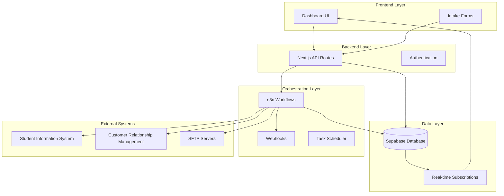

# Airr 3.0 - Autonomous Onboarding Orchestrator

A production-ready autonomous onboarding system that takes customers from contract signed to fully activated through intelligent workflow orchestration, real-time visibility, and deterministic state management.

## Overview

Airr 3.0 is designed as a self-driving onboarding system that prioritizes **clarity, durability, and operational correctness** — the qualities required to scale from POC to production. The system orchestrates integrations, tasks, reminders, and blockers while providing real-time visibility into time-to-value metrics.

### Core Capabilities
- **Autonomous Task Orchestration**: Automatically generates and manages onboarding tasks based on customer requirements
- **Real-time Dashboard**: Live visibility into onboarding progress, blockers, and time-to-value metrics
- **Integration Management**: Handles SIS, CRM, SFTP, and API integrations with testing and validation
- **Intelligent Escalation**: Automated blocker detection and stakeholder notification
- **Complete Auditability**: Full audit trail for compliance and debugging
- **State-driven Workflow**: Deterministic progression through explicit onboarding stages

---

## Architecture & Workflow Design Rationale

### Why the workflow lives inside the product

For Airr 3.0, the onboarding workflow is intentionally designed as a **first-class part of the product**, rather than externalizing business logic into an automation tool.

Onboarding is not a background automation problem — it is a **core domain workflow** that must be:
- **Deterministic and explainable**
- **Auditable over time**
- **Easy to evolve** as onboarding policies change
- **Visible in real time** to operators and customers

To support this, the system implements onboarding as a **state-driven workflow owned by the application itself**. Each customer progresses through explicit stages (e.g. Intake → Integrations Pending → Blocked → Ready for Go-Live → Completed), with all transitions persisted in Supabase and reflected immediately in the UI.

This ensures:
- **The product is the system of record**
- **Workflow state is queryable, debuggable, and replayable**
- **Business rules are versionable alongside application code**
- **The UI always reflects the true operational state**

### Role of n8n in this system

n8n is used intentionally as an **execution and automation layer**, not as the owner of workflow logic.

In production systems, embedding core business workflows inside automation tools can lead to:
- Hidden state
- Fragile coupling
- Difficult debugging and version control

Instead, this project uses n8n where it provides the most value:
- **Asynchronous execution** (delays, retries, timers)
- **Event-driven side effects** (reminders, escalations)
- **Automation that should not block the main product flow**
- **Operational reliability without polluting UI logic**

The application emits explicit onboarding events (e.g. `ONBOARDING_STARTED`, `TASK_BLOCKED_24H`, `ONBOARDING_COMPLETED`) to n8n via webhook triggers. n8n workflows then:
- Send reminders or escalation notifications
- Record audit events back into Supabase
- Handle retry and delay logic safely

This separation mirrors how production platforms treat orchestration tools: **as execution infrastructure, not business brains**.

### Why this approach fits Airr 3.0

Airr 3.0 emphasizes:
- **AI and automation as default execution layers**
- **Lean systems with clear ownership**
- **Trustworthy, explainable operations**
- **Production thinking over demos**

This architecture supports that direction by:
- **Keeping domain logic explicit and testable**
- **Making operational state transparent**
- **Allowing automation to scale independently**
- **Preventing vendor or tool lock-in at the logic layer**

As the system evolves, additional intelligence (AI-driven task creation, risk prediction, dynamic SLA adjustments) can be layered on without rewriting the orchestration spine.

### Summary
- **Workflow ownership**: Application
- **Source of truth**: Supabase
- **Automation & async execution**: n8n
- **UI visibility**: Real-time and state-driven

This design prioritizes clarity, durability, and operational correctness — the same qualities required to take Airr 3.0 from POC to production.

---

## Tech Stack
- **Frontend & Backend**: Next.js 14 with TypeScript
- **Database**: Supabase (PostgreSQL with real-time subscriptions)
- **Workflow Orchestration**: n8n (event-driven automation)
- **Testing**: Vitest with Property-Based Testing (fast-check)
- **Deployment**: Docker + Coolify

---

## System Architecture



### Core Components

**Application Layer (Next.js)**
- **Customer Intake API**: Captures customer details, stakeholders, and integration requirements
- **Stakeholder Management**: CRUD operations for onboarding team members
- **Integration Management**: Configuration and status tracking for external systems
- **Dashboard API**: Real-time aggregation of onboarding metrics and status
- **Task Management**: Automated task generation and status updates

**Data Layer (Supabase)**
- **Customers**: Customer information and contract details
- **Onboardings**: Overall progress tracking and time-to-value metrics
- **Stakeholders**: Team members with roles and responsibilities
- **Integrations**: External system configurations and test results
- **Tasks**: Individual action items with ownership and status
- **Audit Events**: Complete audit trail for compliance and debugging

**Orchestration Layer (n8n)**
- **Task Generation Workflow**: Creates tasks based on customer requirements
- **Reminder & Escalation Workflow**: Automated notifications and escalations
- **Integration Monitoring**: Connectivity testing and status updates

---

## API Endpoints

### Customer Onboarding
- `POST /api/onboarding` - Create new customer onboarding with stakeholders and integrations
- `GET /api/onboarding/[id]` - Retrieve onboarding details and status

### Stakeholder Management
- `POST /api/stakeholders` - Create stakeholder records
- `GET /api/stakeholders/[onboarding_id]` - Get stakeholders for an onboarding
- `PUT /api/stakeholders/update/[id]` - Update stakeholder information

### Integration Management
- `POST /api/integrations` - Define integration requirements
- `GET /api/integrations/[onboarding_id]` - Get integration status
- `PUT /api/integrations/update/[id]` - Update integration configuration

### Dashboard & Analytics
- `GET /api/dashboard` - Aggregate dashboard data and metrics
- `GET /api/health` - System health and connectivity status

---

## Data Models

### Customer Onboarding Flow
1. **Intake**: Customer details, stakeholders, and integration requirements captured
2. **Task Generation**: n8n automatically creates onboarding tasks based on requirements
3. **Execution**: Tasks assigned to stakeholders with automated reminders
4. **Integration Setup**: External systems configured and tested
5. **Monitoring**: Real-time progress tracking with blocker escalation
6. **Completion**: Go-live achieved with full audit trail

### Key Data Structures
```typescript
interface Customer {
  id: string;
  name: string;
  contract_start_date: string;
  contact_email?: string;
  industry?: string;
  size?: 'small' | 'medium' | 'large' | 'enterprise';
}

interface Onboarding {
  id: string;
  customer_id: string;
  status: 'not_started' | 'in_progress' | 'blocked' | 'completed';
  current_stage?: string;
  go_live_date?: string;
  time_to_value_days?: number;
}

interface Stakeholder {
  id: string;
  onboarding_id: string;
  role: 'owner' | 'it_contact' | 'project_manager' | 'technical_lead';
  name: string;
  email: string;
  responsibilities: string[];
}

interface Integration {
  id: string;
  onboarding_id: string;
  type: 'SIS' | 'CRM' | 'SFTP' | 'API' | 'other';
  name: string;
  configuration?: Record<string, any>;
  status: 'not_configured' | 'configured' | 'testing' | 'active' | 'failed';
}
```

---

## Local Development Setup

### Prerequisites
- Node.js 18+
- Supabase project (or local Supabase instance)
- n8n instance (local or hosted)

### Environment Variables
Create a `.env.local` file with:
```bash
NEXT_PUBLIC_SUPABASE_URL=your_supabase_url
SUPABASE_SERVICE_ROLE_KEY=your_service_role_key
N8N_WEBHOOK_URL=your_n8n_webhook_url
```

### Database Setup
1. Run the Supabase migrations:
```bash
# Apply the schema from supabase/migrations.sql
# This creates all necessary tables and relationships
```

2. The schema includes:
   - `customers` - Customer information and contract details
   - `onboardings` - Onboarding progress and metrics
   - `stakeholders` - Team members and responsibilities
   - `integrations` - External system configurations
   - `onboarding_tasks` - Individual tasks and ownership
   - `events_audit` - Complete audit trail

### Installation & Startup
```bash
# Install dependencies
npm install

# Run development server
npm run dev

# Run tests (including property-based tests)
npm test

# Run specific test files
npm test lib/types.test.ts
npm test lib/api-endpoints.test.ts
```

### n8n Workflow Setup
1. Import the workflow from `n8n/onboarding_orchestrator.json`
2. Configure webhook URLs to point to your Next.js application
3. Set up credentials for external integrations (SIS, CRM, SFTP)
4. Test the workflow with sample onboarding data

---

## Testing Strategy

The system uses a comprehensive testing approach combining unit tests and property-based testing:

### Property-Based Testing
- **Framework**: fast-check for TypeScript
- **Coverage**: Universal properties across all inputs (100+ iterations per test)
- **Focus**: Data persistence, validation logic, API consistency
- **Benefits**: Catches edge cases and ensures correctness across input space

### Key Properties Tested
1. **Customer Data Persistence**: All intake data persisted with referential integrity
2. **Future Date Validation**: Go-live dates must be in the future
3. **Stakeholder Management**: CRUD operations maintain data consistency
4. **Integration Lifecycle**: Configuration and status tracking accuracy
5. **API Consistency**: Request/response validation across all endpoints

### Running Tests
```bash
# Run all tests
npm test

# Run with coverage
npm run test:coverage

# Run property-based tests specifically
npm test -- --grep "Property"
```

---

## Production Deployment

### Docker Deployment
```dockerfile
# Dockerfile included for containerized deployment
# Optimized for production with multi-stage builds
```

### Coolify Deployment
The application is designed for deployment via Coolify with:
- Automatic SSL certificates
- Environment variable management
- Database connection pooling
- Health check endpoints

### Environment Configuration
```bash
# Production environment variables
NODE_ENV=production
NEXT_PUBLIC_SUPABASE_URL=your_production_supabase_url
SUPABASE_SERVICE_ROLE_KEY=your_production_service_key
N8N_WEBHOOK_URL=your_production_n8n_webhook
```

---

## Monitoring & Observability

### Health Checks
- `GET /api/health` - System status and connectivity
- Database connection validation
- n8n integration status
- External system connectivity

### Audit Trail
- Complete event logging for all onboarding activities
- Metadata capture for debugging and compliance
- Queryable audit history with timestamps

### Metrics & Analytics
- Time-to-value tracking per customer
- Onboarding stage progression analytics
- Blocker identification and resolution times
- Integration success rates

---

## Development Roadmap

### Phase 1: Core Foundation ✅
- [x] Customer intake with stakeholder and integration management
- [x] State-driven workflow architecture
- [x] Real-time dashboard with Supabase subscriptions
- [x] Property-based testing framework
- [x] Complete audit trail implementation
- [x] n8n integration for async execution

### Phase 2: Intelligence Layer (Next)
- [ ] AI-driven task creation based on customer profile
- [ ] Risk prediction and proactive blocker identification
- [ ] Dynamic SLA adjustments based on customer tier
- [ ] Intelligent stakeholder assignment optimization

### Phase 3: Advanced Operations
- [ ] Role-based access control with Supabase RLS
- [ ] Multi-tenant architecture for enterprise customers
- [ ] Advanced analytics and reporting dashboard
- [ ] Integration marketplace for third-party connectors

### Phase 4: Scale & Reliability
- [ ] Horizontal scaling with load balancing
- [ ] Advanced monitoring and alerting
- [ ] Disaster recovery and backup strategies
- [ ] Performance optimization and caching

---

## Contributing

### Code Quality Standards
- **TypeScript**: Strict type checking enabled
- **Testing**: Property-based tests for core logic, unit tests for edge cases
- **API Design**: RESTful endpoints with consistent error handling
- **Database**: Referential integrity and audit trails required
- **Documentation**: Architecture decisions documented with rationale

### Development Workflow
1. Create feature branch from main
2. Implement functionality with tests
3. Run full test suite including property-based tests
4. Update documentation and API specs
5. Submit PR with clear description and test results

### Property-Based Testing Guidelines
- Use fast-check generators for realistic test data
- Minimum 100 iterations per property test
- Tag tests with feature and property references
- Focus on universal properties, not specific examples
- Validate data integrity and API consistency

---

## Architecture Decisions

### Why State-Driven Workflows
- **Deterministic**: Each state transition is explicit and auditable
- **Debuggable**: Current state always queryable from database
- **Evolvable**: Business rules change without breaking existing workflows
- **Transparent**: UI reflects true operational state in real-time

### Why Property-Based Testing
- **Comprehensive**: Tests across entire input space, not just examples
- **Robust**: Catches edge cases that unit tests miss
- **Maintainable**: Properties remain stable as implementation changes
- **Confidence**: Mathematical guarantees about system behavior

### Why n8n for Orchestration
- **Separation of Concerns**: Business logic in app, execution in n8n
- **Reliability**: Built-in retry, delay, and error handling
- **Scalability**: Async execution doesn't block main application
- **Flexibility**: Easy to modify automation without code changes

---

## License

This project is part of the Airr 3.0 initiative and follows the company's standard licensing terms.

---

## Support & Contact

For questions about architecture, implementation, or deployment:
- Review the comprehensive documentation in `.kiro/specs/`
- Check the property-based tests for behavior examples
- Examine the API endpoints for integration patterns
- Reference the n8n workflows for automation logic

The system is designed to be self-documenting through its test suite and explicit state management.

